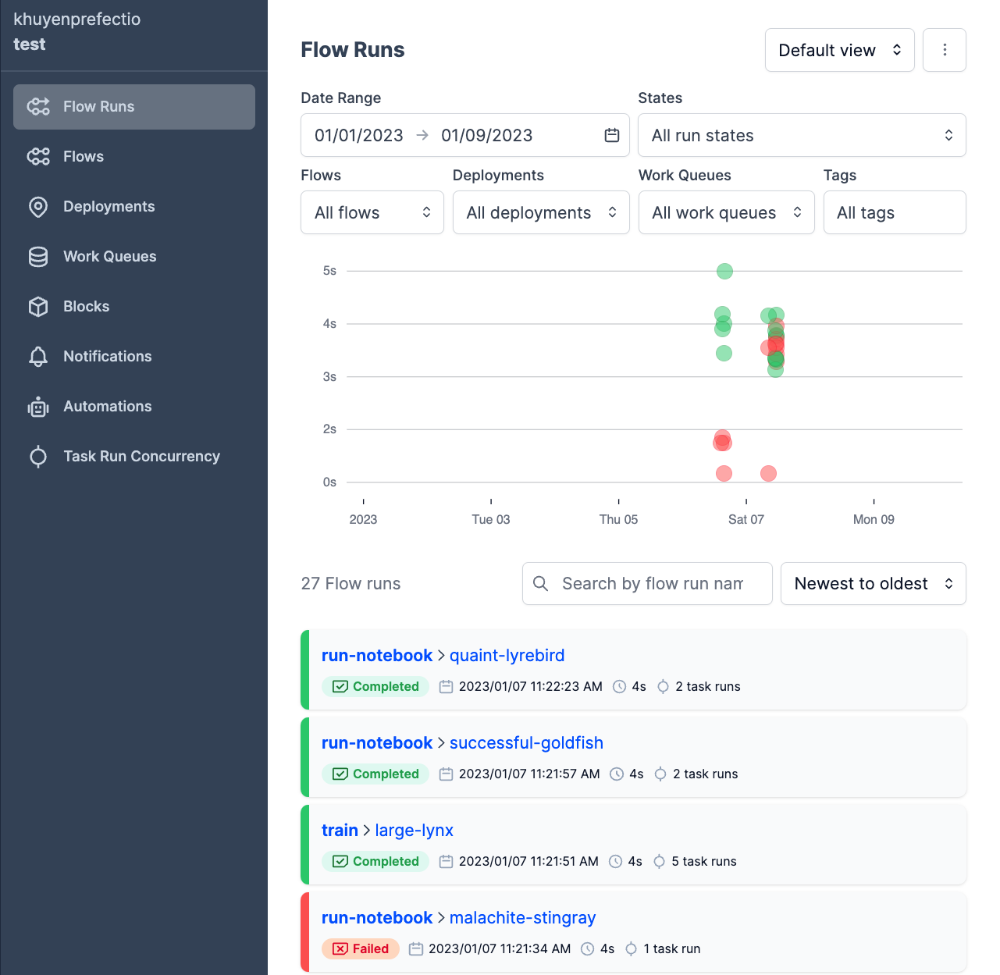

[](https://towardsdatascience.com/how-to-structure-an-ml-project-for-reproducibility-and-maintainability-54d5e53b4c82?sk=c3d05ae5b8ccc95822618d0dacfad8a4)

# Data Science Cookie Cutter

## Why Should You Use This Template?
This template is the result of my years refining the best way to structure a data science project so that it is reproducible and maintainable.

This template allows you to:

:white_check_mark: Create a readable structure for your  project

:white_check_mark: Automatically run tests when committing your code

:white_check_mark: Enforce type hints at runtime 

:white_check_mark: Check issues in your code before committing

:white_check_mark: Efficiently manage the dependencies in your project

:white_check_mark: Create short and readable commands for repeatable tasks

:white_check_mark: Rerun only modified components of a pipeline

:white_check_mark:	Automatically document your code

:white_check_mark:	Observe and automate your code

## Tools used in this project
* [Poetry](https://python-poetry.org/): Dependency management - [article](https://towardsdatascience.com/how-to-effortlessly-publish-your-python-package-to-pypi-using-poetry-44b305362f9f)
* [Prefect](https://www.prefect.io/): Orchestrate and observe your data pipeline - [article](https://medium.com/the-prefect-blog/orchestrate-your-data-science-project-with-prefect-2-0-4118418fd7ce?sk=552f3e60344175768dabbbf033776ce7)
* [Pydantic](https://docs.pydantic.dev/): Data validation using Python type annotations - [article](https://towardsdatascience.com/build-a-full-stack-ml-application-with-pydantic-and-prefect-915f00fe0c62?sk=b1f8c5cb53a6a9d7f48d66fa778e9cf0)
* [pre-commit plugins](https://pre-commit.com/): Automate code reviewing formatting  - [article](https://towardsdatascience.com/4-pre-commit-plugins-to-automate-code-reviewing-and-formatting-in-python-c80c6d2e9f5?sk=2388804fb174d667ee5b680be22b8b1f)
* Makefile: Create short and readable commands for repeatable tasks - [article](https://the-turing-way.netlify.app/reproducible-research/make/make-examples.html)
* [GitHub Actions](https://docs.github.com/en/actions): Automate your workflows, making it faster to build, test, and deploy your code - [article](https://pub.towardsai.net/github-actions-in-mlops-automatically-check-and-deploy-your-ml-model-9a281d7f3c84?sk=d258c20a7ff7a1db44327c27d3f36efb)
* [pdoc](https://github.com/pdoc3/pdoc): Automatically create an API documentation for your project
## Project structure
```bash
.
├── data            
│   ├── final                       # data after training the model
│   ├── processed                   # data after processing
│   ├── raw                         # raw data
├── docs                            # documentation for your project
├── .flake8                         # configuration for flake8 - a Python formatter tool
├── .gitignore                      # ignore files that cannot commit to Git
├── Makefile                        # store useful commands to set up the environment
├── models                          # store models
├── notebooks                       # store notebooks
├── .pre-commit-config.yaml         # configurations for pre-commit
├── pyproject.toml                  # dependencies for poetry
├── README.md                       # describe your project
├── src                             # store source code
│   ├── __init__.py                 # make src a Python module
│   ├── config.py                   # store configs 
│   ├── process.py                  # process data before training model
│   ├── run_notebook.py             # run notebook
│   └── train_model.py              # train model
└── tests                           # store tests
    ├── __init__.py                 # make tests a Python module 
    ├── test_process.py             # test functions for process.py
    └── test_train_model.py         # test functions for train_model.py
```

## Quick Start
### Set up the environment
1. Install [Poetry](https://python-poetry.org/docs/#installation)
2. Set up the environment:
```bash
make setup
make activate
```
### Install new packages
To install new PyPI packages, run:
```bash
poetry add <package-name>
```

### Run Python scripts
To run the Python scripts to process data, train model, and run a notebook, type the following:
```bash
make pipeline
```
### View all flow runs
A [flow](https://docs.prefect.io/concepts/flows/) is the basis of all Prefect workflows.

To view your flow runs from a UI, sign in to your [Prefect Cloud](https://app.prefect.cloud/) account or spin up a Prefect Orion server on your local machine:
```bash
prefect orion start
```
Open the URL http://127.0.0.1:4200/, and you should see the Prefect UI:



### Run flows from the UI

After [creating a deployment](https://towardsdatascience.com/build-a-full-stack-ml-application-with-pydantic-and-prefect-915f00fe0c62?sk=b1f8c5cb53a6a9d7f48d66fa778e9cf0), you can run a flow from the UI with default parameters:


or custom parameters:


### Auto-generate API documentation

To auto-generate API document for your project, run:

```bash
make docs_save
```

### Run tests when creating a PR
When creating a PR, the tests in your `tests` folder will automatically run. 


